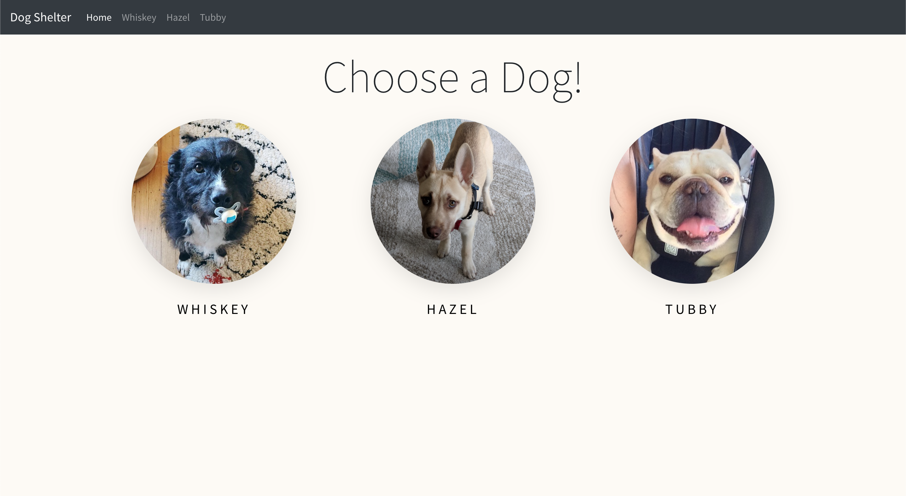

# React Router Patterns Dog App

### Description

This project aims to practice using React Router. The goal is to build an app that allows a user to browse dogs.

The <App /> component should render:
- a <Nav /> component with the dogs’ names passed as props
- a <Switch> with your <Route /> declarations

The app should have the following routes:
- **/dogs**: the homepage that shows all three dogs
- **/dogs/:dogName**: a page for each dog that shows its informations
- every other endpoint not listed should redirect you to the homepage

Make the website responsive (if you have time) using Bootstrap to add a responsive navbar and grid layout.

The app displays an interface that looks like this:

### Technologies

*Languages:* Javascript, HTML, CSS

*Libraries:* React, React Router, Bootstrap

### Key features

* The user can navigate thanks to the navbar

* The user can view all the dogs on the homepage

* The user can view the details about a dog

* The user is redirected to the homepage if entering a non-existing url

### Poject status

The project is ongoing.

### Credits & Sources

* Another small project from [The Modern React Bootcamp](https://www.udemy.com/course/modern-react-bootcamp)
